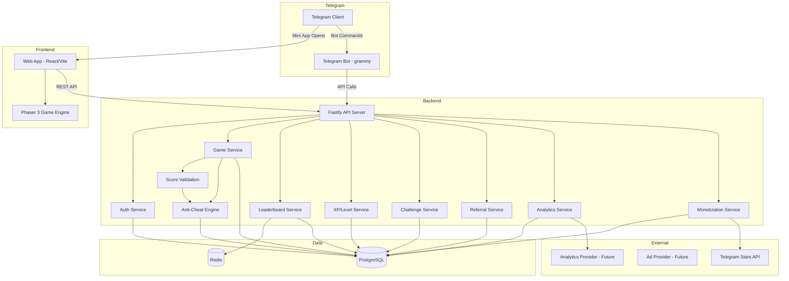
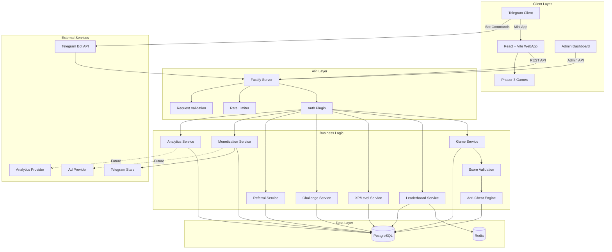

# GTX Rush — Architecture Document v1.0

**Date:** August 24, 2026
**Status:** Master Architecture — Single Source of Truth
**Tagline:** Play. Compete. Rise. ⚡

---

## A. Executive Architecture Summary

GTX Rush is a Telegram-native competitive gaming platform delivering three MVP games (Reaction Rush, Tap Rush, Quiz Rush) within a monorepo architecture. The system is built around **server-authoritative scoring**, **Telegram identity-first authentication**, and a **modular game engine** that allows new games to be added without modifying core infrastructure (leaderboards, XP, analytics, monetization).

**Key architectural decisions:**
- **Fastify** backend (chosen over NestJS for lower overhead, faster cold starts, and better suited for a lightweight gaming API)
- **PostgreSQL** for persistent data with **Redis** for leaderboards, caching, and rate limiting
- **REST API** for MVP; WebSocket added only when real-time competitive play demands it
- **Monorepo** with Turborepo for shared types, validation, game engine, and config
- **Server-authoritative** — all scores calculated and validated server-side; the client is a thin rendering layer
- **Rule-based anti-cheat** foundation that can evolve into ML-based detection later

**Scale targets:**
- MVP: 1,000 concurrent users
- Growth: 10,000 concurrent users
- Future: 100,000+ concurrent users (horizontal scaling via API replicas + Redis/PostgreSQL clustering)

---

## B. Recommended Final Technology Stack

### Frontend
| Tool | Purpose |
|------|---------|
| React 18+ | UI framework |
| TypeScript 5.x | Type safety |
| Vite | Build tool / dev server |
| @grammyjs/types or @twa-dev/sdk | Telegram Mini Apps SDK |
| Phaser 3 | Game rendering engine |
| Tailwind CSS | Styling |

### Backend
| Tool | Purpose |
|------|---------|
| Node.js 20+ LTS | Runtime |
| TypeScript 5.x | Type safety |
| Fastify | HTTP framework (chosen for speed, schema validation, plugin architecture) |
| Drizzle ORM | Database access (type-safe, lightweight, SQL-first) |
| Zod | Runtime validation (shared with frontend via packages/validation) |
| Redis (ioredis) | Leaderboards, sessions, caching, rate limiting |

### Database
| Tool | Purpose |
|------|---------|
| PostgreSQL 16+ | Primary database |
| Redis 7+ | Caching, sorted sets for leaderboards, pub/sub, rate limiting |

### Infrastructure
| Tool | Purpose |
|------|---------|
| Turborepo | Monorepo build orchestration |
| pnpm | Package manager |
| Docker | Local dev environment |
| GitHub Actions | CI/CD |

### Why Fastify over NestJS?
1. **Performance** — Fastify is one of the fastest Node.js HTTP frameworks, critical for a gaming API
2. **Lower overhead** — No decorators, no Angular-inspired complexity; Fastify uses a plugin system that's composable and lightweight
3. **Built-in JSON schema validation** — Request/response validation is a first-class feature
4. **WebSocket support** — `@fastify/websocket` for future real-time features
5. **Easier to understand** — Simpler mental model for a team building quickly
6. **TypeScript-native** — First-class TypeScript support without configuration gymnastics

### Why Drizzle ORM over Prisma?
1. **SQL-first** — Writes SQL, not a custom query language; easier to optimize
2. **Lighter runtime** — No binary engine to ship; smaller bundle
3. **Better for serverless/edge** — Critical for free-tier deployment
4. **Type safety** — Excellent TypeScript types without code generation delays

---

## C. Complete Monorepo Folder Structure

```
gtx-rush/
├── apps/
│   ├── web/                          # Telegram Mini App frontend
│   │   ├── src/
│   │   │   ├── components/           # React UI components
│   │   │   │   ├── layout/           # Navigation, shell
│   │   │   │   ├── game/             # Game UI wrappers
│   │   │   │   ├── leaderboard/      # Leaderboard views
│   │   │   │   ├── profile/          # Profile & settings
│   │   │   │   └── common/           # Shared UI (buttons, cards, modals)
│   │   │   ├── pages/                # Route-level components
│   │   │   │   ├── Home.tsx
│   │   │   │   ├── Games.tsx
│   │   │   │   ├── Leaderboard.tsx
│   │   │   │   ├── Rewards.tsx
│   │   │   │   ├── Profile.tsx
│   │   │   │   └── GamePlay.tsx
│   │   │   ├── hooks/                # React hooks
│   │   │   ├── stores/               # State management (zustand)
│   │   │   ├── services/             # API client layer
│   │   │   ├── lib/                  # Utility functions
│   │   │   ├── assets/               # Static assets
│   │   │   ├── styles/               # Global styles, Tailwind config
│   │   │   ├── App.tsx
│   │   │   └── main.tsx
│   │   ├── index.html
│   │   ├── vite.config.ts
│   │   ├── tailwind.config.ts
│   │   ├── tsconfig.json
│   │   └── package.json
│   │
│   ├── api/                          # Backend API server
│   │   ├── src/
│   │   │   ├── routes/               # Fastify route handlers
│   │   │   │   ├── auth/             # Authentication routes
│   │   │   │   ├── games/            # Game session & score routes
│   │   │   │   ├── leaderboard/      # Leaderboard routes
│   │   │   │   ├── challenges/       # Daily & friend challenges
│   │   │   │   ├── users/            # User profile routes
│   │   │   │   ├── progression/      # XP, levels, streaks
│   │   │   │   ├── referrals/        # Referral system
│   │   │   │   ├── monetization/     # Stars, purchases
│   │   │   │   └── analytics/        # Event ingestion
│   │   │   ├── plugins/              # Fastify plugins
│   │   │   │   ├── auth.ts           # Auth verification plugin
│   │   │   │   ├── rate-limit.ts     # Rate limiting
│   │   │   │   ├── error-handler.ts  # Global error handling
│   │   │   │   └── logger.ts         # Request logging
│   │   │   ├── middleware/           # Request middleware
│   │   │   ├── services/             # Business logic layer
│   │   │   │   ├── game.service.ts
│   │   │   │   ├── score.service.ts
│   │   │   │   ├── leaderboard.service.ts
│   │   │   │   ├── user.service.ts
│   │   │   │   ├── progression.service.ts
│   │   │   │   ├── challenge.service.ts
│   │   │   │   ├── referral.service.ts
│   │   │   │   ├── anti-cheat.service.ts
│   │   │   │   ├── analytics.service.ts
│   │   │   │   └── monetization.service.ts
│   │   │   ├── db/                   # Database layer
│   │   │   │   ├── schema.ts         # Drizzle schema definitions
│   │   │   │   ├── index.ts          # Database connection
│   │   │   │   └── migrations/       # SQL migrations
│   │   │   ├── config/               # Environment & app config
│   │   │   ├── lib/                  # Utility functions
│   │   │   └── index.ts              # Server entry point
│   │   ├── drizzle.config.ts
│   │   ├── tsconfig.json
│   │   └── package.json
│   │
│   ├── bot/                          # Telegram bot (game bot)
│   │   ├── src/
│   │   │   ├── commands/             # Bot command handlers
│   │   │   ├── handlers/             # Callback query handlers
│   │   │   ├── keyboards/            # Inline keyboards
│   │   │   ├── services/             # Bot-specific services
│   │   │   ├── middlewares/          # Bot middlewares
│   │   │   ├── config/              # Bot configuration
│   │   │   └── index.ts             # Bot entry point
│   │   ├── tsconfig.json
│   │   └── package.json
│   │
│   └── admin/                        # Admin dashboard
│       ├── src/
│       │   ├── components/           # Admin UI components
│       │   ├── pages/                # Admin pages
│       │   │   ├── Dashboard.tsx
│       │   │   ├── Users.tsx
│       │   │   ├── Games.tsx
│       │   │   ├── Challenges.tsx
│       │   │   ├── Leaderboards.tsx
│       │   │   ├── Revenue.tsx
│       │   │   ├── Fraud.tsx
│       │   │   └── Analytics.tsx
│       │   ├── services/             # Admin API client
│       │   ├── hooks/                # Admin hooks
│       │   ├── App.tsx
│       │   └── main.tsx
│       ├── index.html
│       ├── vite.config.ts
│       ├── tsconfig.json
│       └── package.json
│
├── packages/
│   ├── types/                        # Shared TypeScript types & interfaces
│   │   ├── src/
│   │   │   ├── user.ts               # User-related types
│   │   │   ├── game.ts               # Game-related types
│   │   │   ├── leaderboard.ts        # Leaderboard types
│   │   │   ├── challenge.ts          # Challenge types
│   │   │   ├── progression.ts        # XP, level, streak types
│   │   │   ├── monetization.ts       # Payment, purchase types
│   │   │   ├── analytics.ts          # Analytics event types
│   │   │   ├── admin.ts              # Admin types
│   │   │   ├── api.ts                # API request/response types
│   │   │   └── index.ts              # Re-exports
│   │   ├── tsconfig.json
│   │   └── package.json
│   │
│   ├── config/                       # Shared configuration
│   │   ├── src/
│   │   │   ├── env.ts                # Environment variable validation
│   │   │   ├── games.ts              # Game configuration constants
│   │   │   ├── progression.ts        # XP/level config
│   │   │   ├── anti-cheat.ts         # Anti-cheat thresholds
│   │   │   └── index.ts
│   │   ├── tsconfig.json
│   │   └── package.json
│   │
│   ├── validation/                   # Shared Zod schemas
│   │   ├── src/
│   │   │   ├── user.ts               # User validation schemas
│   │   │   ├── game.ts               # Game validation schemas
│   │   │   ├── score.ts              # Score submission schemas
│   │   │   ├── challenge.ts          # Challenge schemas
│   │   │   ├── auth.ts               # Auth schemas
│   │   │   ├── admin.ts              # Admin validation schemas
│   │   │   └── index.ts
│   │   ├── tsconfig.json
│   │   └── package.json
│   │
│   ├── game-engine/                  # Reusable game abstraction layer
│   │   ├── src/
│   │   │   ├── base-game.ts          # BaseGame abstract class
│   │   │   ├── game-registry.ts      # Game registration & discovery
│   │   │   ├── session-manager.ts    # Game session lifecycle
│   │   │   ├── score-validator.ts    # Score validation framework
│   │   │   ├── anti-cheat.ts         # Anti-cheat rule engine
│   │   │   ├── types.ts              # Game engine types
│   │   │   └── index.ts
│   │   ├── tsconfig.json
│   │   └── package.json
│   │
│   ├── telegram/                     # Telegram-specific utilities
│   │   ├── src/
│   │   │   ├── auth.ts               # Telegram init data validation
│   │   │   ├── deep-links.ts         # Deep link generation
│   │   │   ├── webapp.ts             # WebApp SDK helpers
│   │   │   ├── bot-api.ts            # Bot API helpers
│   │   │   └── index.ts
│   │   ├── tsconfig.json
│   │   └── package.json
│   │
│   ├── analytics/                    # Analytics abstraction layer
│   │   ├── src/
│   │   │   ├── events.ts             # Event taxonomy definitions
│   │   │   ├── tracker.ts            # Event tracking interface
│   │   │   ├── provider.ts           # Analytics provider abstraction
│   │   │   └── index.ts
│   │   ├── tsconfig.json
│   │   └── package.json
│   │
│   └── ui/                           # Shared UI component library
│       ├── src/
│       │   ├── components/           # Reusable React components
│       │   │   ├── Button.tsx
│       │   │   ├── Card.tsx
│       │   │   ├── Modal.tsx
│       │   │   ├── Leaderboard.tsx
│       │   │   ├── ScoreDisplay.tsx
│       │   │   └── LoadingSpinner.tsx
│       │   ├── styles/               # Component styles
│       │   ├── hooks/                # Shared hooks
│       │   └── index.ts
│       ├── tsconfig.json
│       └── package.json
│
├── games/                            # Individual game packages
│   ├── reaction-rush/
│   │   ├── src/
│   │   │   ├── index.ts              # Game definition & registration
│   │   │   ├── scene.ts              # Phaser scene
│   │   │   ├── config.ts             # Game-specific config
│   │   │   ├── scoring.ts            # Score calculation logic
│   │   │   ├── validation.ts         # Anti-cheat rules for this game
│   │   │   └── types.ts              # Game-specific types
│   │   ├── tsconfig.json
│   │   └── package.json
│   │
│   ├── tap-rush/
│   │   ├── src/
│   │   │   ├── index.ts
│   │   │   ├── scene.ts
│   │   │   ├── config.ts
│   │   │   ├── scoring.ts
│   │   │   ├── validation.ts
│   │   │   └── types.ts
│   │   ├── tsconfig.json
│   │   └── package.json
│   │
│   └── quiz-rush/
│       ├── src/
│       │   ├── index.ts
│       │   ├── scene.ts
│       │   ├── config.ts
│       │   ├── scoring.ts
│       │   ├── validation.ts
│       │   ├── questions/            # Question bank
│       │   └── types.ts
│       ├── tsconfig.json
│       └── package.json
│
├── docs/                             # Documentation
│   ├── architecture.md               # This document
│   ├── api-reference.md              # API documentation (future)
│   ├── game-dev-guide.md             # Guide for adding new games (future)
│   └── deployment.md                 # Deployment guide (future)
│
├── scripts/                          # Utility scripts
│   ├── db-migrate.ts                 # Database migration runner
│   └── seed.ts                        # Database seeding
│
├── .github/
│   └── workflows/
│       ├── ci.yml                     # CI pipeline
│       └── deploy.yml                 # Deployment pipeline (future)
│
├── docker-compose.yml                 # Local dev environment
├── turbo.json                         # Turborepo config
├── package.json                       # Root package.json (pnpm workspaces)
├── pnpm-workspace.yaml                # Workspace definition
├── tsconfig.base.json                 # Shared TypeScript config
├── .gitignore
├── .env.example                       # Environment variable template
├── README.md
└── ARCHITECTURE.md                    # Symlink/copy to docs/architecture.md
```

### Directory Explanations

**`apps/web/`** — The Telegram Mini App frontend. React + Vite + Tailwind. Contains game wrappers that initialize Phaser canvases, UI for leaderboards, profiles, and navigation. This is what Telegram loads.

**`apps/api/`** — The Fastify backend. Handles all business logic, authentication, score validation, leaderboard management, and data persistence. All game logic validation happens here.

**`apps/bot/`** — The Telegram bot that users interact with in Telegram chat. Sends challenge links, notifies of results, provides quick-access to the Mini App. Uses grammy.

**`apps/admin/`** — Admin dashboard. Separate Vite app with elevated permissions. For managing users, games, challenges, fraud review, and analytics.

**`packages/types/`** — Zero-dependency TypeScript types shared across all apps and packages. Single source of truth for interfaces.

**`packages/config/`** — Shared configuration constants: game configs, progression rules, anti-cheat thresholds. Environment-validated config.

**`packages/validation/`** — Zod schemas for request/response validation. Shared between frontend (form validation) and backend (API validation).

**`packages/game-engine/`** — The core game abstraction. Provides `BaseGame` class, session management, score validation framework, and anti-cheat rules. All three MVP games implement this interface.

**`packages/telegram/`** — Telegram-specific utilities: init data validation, deep link generation, WebApp SDK helpers.

**`packages/analytics/`** — Analytics event tracking abstraction. Defines event taxonomy and provider interface. Actual analytics provider (e.g., PostHog, Mixpanel) plugged in later.

**`packages/ui/`** — Shared React UI components. Button, Card, Modal, Leaderboard display, etc. Used by both web and admin apps.

**`games/`** — Individual game packages. Each contains the game definition, Phaser scene, scoring logic, and game-specific anti-cheat rules. These are imported by both the web app (for rendering) and the API (for server-side validation).

---

## D. System Architecture Diagram



---

## E. Core Data Model

### User Domain

```
users (1) ────── (1) user_profiles
users (1) ────── (N) user_badges
users (1) ────── (N) user_cosmetics
users (1) ────── (N) xp_transactions
users (1) ────── (N) game_sessions
users (1) ────── (N) referrals (as referrer)
users (1) ────── (N) referrals (as referred)
users (1) ────── (N) friend_challenges (as challenger)
users (1) ────── (N) friend_challenges (as opponent)
```

### Game Domain

```
games (1) ────── (N) game_versions
games (1) ────── (N) game_sessions
games (1) ────── (N) daily_challenges
games (1) ────── (N) leaderboard_entries
games (1) ────── (N) friend_challenges
game_sessions (1) ── (N) game_scores
```

### Competition Domain

```
leaderboards (1) ── (N) leaderboard_entries
daily_challenges (1) ── (N) challenge_attempts
friend_challenges (1) ── (2) users
```

### Progression Domain

```
users (1) ────── (N) xp_transactions
users (1) ────── (N) badges (via user_badges)
badges (1) ────── (N) user_badges
cosmetics (1) ──── (N) user_cosmetics
users (1) ────── (N) user_cosmetics
```

### Monetization Domain

```
users (1) ────── (N) purchases
users (1) ────── (N) subscriptions
```

---

## F. Database Entity Relationship Explanation

### Table: `users`
**Purpose:** Core user identity, linked to Telegram.
| Field | Type | Notes |
|-------|------|-------|
| id | UUID (PK) | |
| telegram_id | BIGINT (UNIQUE) | Telegram user ID |
| username | VARCHAR(64) | Telegram username |
| display_name | VARCHAR(128) | User's chosen display name |
| country | CHAR(2) | ISO 3166-1 alpha-2 |
| avatar_url | TEXT | Telegram avatar or custom |
| level | INTEGER (default 1) | Computed from XP, cached here |
| xp_total | BIGINT (default 0) | Total XP earned |
| current_streak | INTEGER (default 0) | Days played consecutively |
| longest_streak | INTEGER (default 0) | All-time streak record |
| last_active_at | TIMESTAMP | Last day played (for streak) |
| status | ENUM('active','suspended','banned') | |
| created_at | TIMESTAMP | |
| updated_at | TIMESTAMP | |

**Indexes:** `telegram_id` (unique), `level`, `country`, `status`
**Security:** Telegram ID never exposed to other users. Only admin可见.

### Table: `user_profiles`
**Purpose:** Extended profile data, separate for query performance.
| Field | Type | Notes |
|-------|------|-------|
| id | UUID (PK) | |
| user_id | UUID (FK → users) | UNIQUE |
| bio | VARCHAR(256) | Optional bio |
| total_games_played | INTEGER (default 0) | Denormalized counter |
| total_score | BIGINT (default 0) | Denormalized counter |
| favorite_game_id | UUID (FK → games) | |
| settings | JSONB | User preferences (notifications, etc.) |

**Indexes:** `user_id` (unique)

### Table: `games`
**Purpose:** Game catalog and configuration.
| Field | Type | Notes |
|-------|------|-------|
| id | UUID (PK) | |
| slug | VARCHAR(64) (UNIQUE) | e.g., 'reaction-rush' |
| name | VARCHAR(128) | Display name |
| description | TEXT | |
| is_active | BOOLEAN | Can be toggled on/off |
| config | JSONB | Game-specific configuration |
| min_level | INTEGER | Level required to play |
| created_at | TIMESTAMP | |
| updated_at | TIMESTAMP | |

**Indexes:** `slug` (unique), `is_active`

### Table: `game_versions`
**Purpose:** Versioned game definitions for score compatibility.
| Field | Type | Notes |
|-------|------|-------|
| id | UUID (PK) | |
| game_id | UUID (FK → games) | |
| version | INTEGER | Incremental version number |
| rules | JSONB | Game rules for this version |
| is_active | BOOLEAN | Current playable version |
| created_at | TIMESTAMP | |

**Indexes:** `game_id + version` (unique composite)

### Table: `game_sessions`
**Purpose:** Tracks every game session from start to finish.
| Field | Type | Notes |
|-------|------|-------|
| id | UUID (PK) | |
| user_id | UUID (FK → users) | |
| game_id | UUID (FK → games) | |
| game_version_id | UUID (FK → game_versions) | |
| status | ENUM('active','completed','expired','disqualified') | |
| client_session_token | VARCHAR(128) | Client-generated token for anti-replay |
| started_at | TIMESTAMP | |
| completed_at | TIMESTAMP | |
| ip_address | INET | For fraud detection |
| user_agent | TEXT | Client fingerprint |
| device_info | JSONB | Screen size, platform, etc. |

**Indexes:** `user_id + game_id + started_at`, `status`
**Security:** IP stored for fraud detection only, not displayed.

### Table: `game_scores`
**Purpose:** Final validated scores for each session.
| Field | Type | Notes |
|-------|------|-------|
| id | UUID (PK) | |
| session_id | UUID (FK → game_sessions) | UNIQUE |
| user_id | UUID (FK → users) | Denormalized for query speed |
| game_id | UUID (FK → games) | Denormalized for query speed |
| score | INTEGER | Final server-calculated score |
| raw_data | JSONB | Game-specific score breakdown |
| is_personal_best | BOOLEAN | |
| anti_cheat_flags | JSONB | Any triggered anti-cheat rules |
| validated_at | TIMESTAMP | |
| created_at | TIMESTAMP | |

**Indexes:** `user_id + game_id + score DESC`, `game_id + score DESC`, `created_at`
**Security:** Score is server-calculated. `raw_data` contains evidence for audit.

### Table: `leaderboards`
**Purpose:** Defines leaderboard instances.
| Field | Type | Notes |
|-------|------|-------|
| id | UUID (PK) | |
| game_id | UUID (FK → games) | NULL for global |
| type | ENUM('global','country','friends','weekly','game_specific') | |
| country_code | CHAR(2) | For country leaderboards |
| period_start | TIMESTAMP | For weekly/seasonal |
| period_end | TIMESTAMP | |
| is_active | BOOLEAN | |
| created_at | TIMESTAMP | |

**Indexes:** `game_id + type + country_code`, `period_start + period_end`

### Table: `leaderboard_entries`
**Purpose:** Individual rankings within leaderboards.
| Field | Type | Notes |
|-------|------|-------|
| id | UUID (PK) | |
| leaderboard_id | UUID (FK → leaderboards) | |
| user_id | UUID (FK → users) | |
| score | INTEGER | Best score in period |
| rank | INTEGER | Cached rank position |
| entry_count | INTEGER | Number of games played |
| last_score_at | TIMESTAMP | |
| created_at | TIMESTAMP | |
| updated_at | TIMESTAMP | |

**Indexes:** `leaderboard_id + score DESC`, `leaderboard_id + user_id` (unique composite)
**Unique constraint:** `(leaderboard_id, user_id)` — one entry per user per leaderboard

### Table: `daily_challenges`
**Purpose:** Daily challenge definitions.
| Field | Type | Notes |
|-------|------|-------|
| id | UUID (PK) | |
| game_id | UUID (FK → games) | |
| title | VARCHAR(128) | |
| description | TEXT | |
| challenge_date | DATE | |
| rules | JSONB | Challenge-specific rules |
| max_attempts | INTEGER | |
| starts_at | TIMESTAMP | |
| ends_at | TIMESTAMP | |
| status | ENUM('draft','active','completed','archived') | |
| reward_xp | INTEGER | XP reward for completion |
| reward_badge_id | UUID (FK → badges) | Optional badge reward |
| created_by | UUID (FK → admin_users) | |
| created_at | TIMESTAMP | |

**Indexes:** `challenge_date + status`, `game_id`

### Table: `challenge_attempts`
**Purpose:** Records each attempt at a daily challenge.
| Field | Type | Notes |
|-------|------|-------|
| id | UUID (PK) | |
| challenge_id | UUID (FK → daily_challenges) | |
| user_id | UUID (FK → users) | |
| session_id | UUID (FK → game_sessions) | |
| score | INTEGER | |
| attempt_number | INTEGER | 1-based |
| created_at | TIMESTAMP | |

**Indexes:** `challenge_id + user_id + attempt_number`, `challenge_id + score DESC`
**Unique constraint:** `(challenge_id, user_id, attempt_number)`

### Table: `friend_challenges`
**Purpose:** Peer-to-peer challenge system.
| Field | Type | Notes |
|-------|------|-------|
| id | UUID (PK) | |
| game_id | UUID (FK → games) | |
| challenger_id | UUID (FK → users) | Creator |
| opponent_id | UUID (FK → users) | NULL until accepted |
| challenge_token | VARCHAR(128) (UNIQUE) | For deep link |
| challenger_session_id | UUID (FK → game_sessions) | |
| opponent_session_id | UUID (FK → game_sessions) | NULL until played |
| challenger_score | INTEGER | |
| opponent_score | INTEGER | |
| status | ENUM('pending','accepted','completed','expired','cancelled') | |
| expires_at | TIMESTAMP | |
| created_at | TIMESTAMP | |
| completed_at | TIMESTAMP | |

**Indexes:** `challenge_token` (unique), `challenger_id + created_at`, `opponent_id + status`

### Table: `referrals`
**Purpose:** Referral tracking and attribution.
| Field | Type | Notes |
|-------|------|-------|
| id | UUID (PK) | |
| referrer_id | UUID (FK → users) | |
| referred_id | UUID (FK → users) | |
| referral_code | VARCHAR(32) (UNIQUE) | Short code |
| status | ENUM('pending','activated','expired') | |
| activated_at | TIMESTAMP | When milestone met |
| activation_event | VARCHAR(64) | What triggered activation |
| created_at | TIMESTAMP | |

**Indexes:** `referral_code` (unique), `referrer_id`, `referred_id` (unique — one referrer per user)

### Table: `xp_transactions`
**Purpose:** Immutable ledger of all XP earned/spent.
| Field | Type | Notes |
|-------|------|-------|
| id | UUID (PK) | |
| user_id | UUID (FK → users) | |
| amount | INTEGER | Positive = earned, negative = spent |
| source | ENUM('game_play','game_win','daily_challenge','streak','friend_challenge','achievement','purchase','admin_adjustment') | |
| reference_id | UUID | ID of the related entity |
| reference_type | VARCHAR(32) | 'game_session', 'challenge', etc. |
| balance_after | BIGINT | Running balance for audit |
| created_at | TIMESTAMP | |

**Indexes:** `user_id + created_at`, `source`
**Security:** Append-only. No updates/deletes allowed.

### Table: `levels`
**Purpose:** XP thresholds for each level.
| Field | Type | Notes |
|-------|------|-------|
| level | INTEGER (PK) | |
| xp_required | BIGINT | Cumulative XP needed |
| title | VARCHAR(64) | Level title (e.g., "Rookie", "Pro") |
| rewards | JSONB | Rewards unlocked at this level |

### Table: `badges`
**Purpose:** Badge definitions.
| Field | Type | Notes |
|-------|------|-------|
| id | UUID (PK) | |
| slug | VARCHAR(64) (UNIQUE) | |
| name | VARCHAR(128) | |
| description | TEXT | |
| icon_url | TEXT | |
| category | VARCHAR(32) | 'gameplay', 'social', 'streak', etc. |
| rarity | ENUM('common','rare','epic','legendary') | |
| criteria | JSONB | Auto-award conditions |
| is_active | BOOLEAN | |
| created_at | TIMESTAMP | |

### Table: `user_badges`
**Purpose:** Badges earned by users.
| Field | Type | Notes |
|-------|------|-------|
| id | UUID (PK) | |
| user_id | UUID (FK → users) | |
| badge_id | UUID (FK → badges) | |
| earned_at | TIMESTAMP | |

**Unique constraint:** `(user_id, badge_id)`

### Table: `cosmetics`
**Purpose:** Purchasable cosmetic items.
| Field | Type | Notes |
|-------|------|-------|
| id | UUID (PK) | |
| slug | VARCHAR(64) (UNIQUE) | |
| name | VARCHAR(128) | |
| description | TEXT | |
| category | VARCHAR(32) | 'avatar_frame', 'profile_bg', 'title', etc. |
| rarity | ENUM('common','rare','epic','legendary') | |
| price_stars | INTEGER | Telegram Stars price |
| asset_url | TEXT | |
| is_active | BOOLEAN | |
| created_at | TIMESTAMP | |

### Table: `user_cosmetics`
**Purpose:** Cosmetics owned by users.
| Field | Type | Notes |
|-------|------|-------|
| id | UUID (PK) | |
| user_id | UUID (FK → users) | |
| cosmetic_id | UUID (FK → cosmetics) | |
| is_equipped | BOOLEAN | |
| purchased_at | TIMESTAMP | |

**Unique constraint:** `(user_id, cosmetic_id)`

### Table: `purchases`
**Purpose:** Payment transaction records.
| Field | Type | Notes |
|-------|------|-------|
| id | UUID (PK) | |
| user_id | UUID (FK → users) | |
| item_type | ENUM('cosmetic','boost','premium_feature','extra_attempt') | |
| item_id | UUID | Reference to purchased item |
| amount_stars | INTEGER | Stars spent |
| telegram_payment_id | VARCHAR(128) | Telegram Stars transaction ID |
| status | ENUM('pending','completed','failed','refunded') | |
| idempotency_key | VARCHAR(128) (UNIQUE) | Prevent duplicate charges |
| created_at | TIMESTAMP | |
| completed_at | TIMESTAMP | |

**Indexes:** `user_id + created_at`, `telegram_payment_id`, `idempotency_key` (unique)
**Security:** All payment verification server-side. Never trust client payment status.

### Table: `analytics_events`
**Purpose:** Event log for analytics.
| Field | Type | Notes |
|-------|------|-------|
| id | UUID (PK) | |
| event_name | VARCHAR(64) | |
| user_id | UUID (FK → users) | NULL for anonymous |
| properties | JSONB | Event-specific data |
| session_id | UUID | Client session |
| ip_address | INET | |
| created_at | TIMESTAMP | |

**Indexes:** `event_name + created_at`, `user_id + created_at`
**Note:** Partition by month for performance at scale.

### Table: `fraud_flags`
**Purpose:** Detected suspicious activity.
| Field | Type | Notes |
|-------|------|-------|
| id | UUID (PK) | |
| user_id | UUID (FK → users) | |
| flag_type | VARCHAR(64) | e.g., 'impossible_score', 'multi_account' |
| severity | ENUM('low','medium','high','critical') | |
| evidence | JSONB | Supporting data |
| status | ENUM('detected','reviewing','confirmed','dismissed') | |
| reviewed_by | UUID (FK → admin_users) | |
| created_at | TIMESTAMP | |
| resolved_at | TIMESTAMP | |

**Indexes:** `user_id + flag_type`, `status + severity`

### Table: `admin_users`
**Purpose:** Admin access management.
| Field | Type | Notes |
|-------|------|-------|
| id | UUID (PK) | |
| user_id | UUID (FK → users) | NULL for non-TG admins |
| email | VARCHAR(255) (UNIQUE) | Admin login |
| password_hash | VARCHAR(255) | bcrypt hash |
| role | ENUM('super_admin','admin','moderator','viewer') | |
| permissions | JSONB | Granular permissions |
| is_active | BOOLEAN | |
| last_login_at | TIMESTAMP | |
| created_at | TIMESTAMP | |

**Indexes:** `email` (unique), `role`

---

## G. API Architecture

### Design Principles
- RESTful endpoints following resource-based URL patterns
- Consistent JSON response envelope: `{ success: boolean, data?: T, error?: { code: string, message: string } }`
- Pagination via cursor-based approach: `{ data: T[], pagination: { next_cursor?: string, has_more: boolean } }`
- All requests authenticated via Telegram init data (except health check)
- Input validation via Zod schemas (shared `packages/validation`)
- Rate limiting per user and per IP

### API Route Map

```
POST   /api/auth/verify              # Verify Telegram init data, return JWT
POST   /api/auth/refresh             # Refresh JWT token

GET    /api/users/me                  # Get current user profile
PATCH  /api/users/me                  # Update display name, avatar, settings
GET    /api/users/:id                 # Get public user profile
GET    /api/users/me/stats            # Get user statistics
GET    /api/users/me/badges           # Get user badges
GET    /api/users/me/cosmetics        # Get user cosmetics
PATCH  /api/users/me/cosmetics/equip  # Equip cosmetic item

GET    /api/games                     # List active games
GET    /api/games/:slug               # Get game details
GET    /api/games/:slug/config        # Get game configuration (client needs this)
GET    /api/games/:slug/best          # Get personal best for game

POST   /api/sessions/start            # Start game session → returns session_id
POST   /api/sessions/:id/input        # Submit game input data (during gameplay)
POST   /api/sessions/:id/finish       # Finish session → server calculates & validates score
GET    /api/sessions/:id/result       # Get validated score result

GET    /api/leaderboards              # List all leaderboard types
GET    /api/leaderboards/:type        # Get leaderboard (global, country, weekly, game-specific)
GET    /api/leaderboards/:type/rank   # Get user's rank in leaderboard

GET    /api/challenges/daily          # Get today's daily challenge
POST   /api/challenges/daily/attempt  # Submit daily challenge attempt
GET    /api/challenges/daily/history  # Get user's daily challenge history

POST   /api/challenges/friend/create  # Create friend challenge → returns deep link
GET    /api/challenges/friend/:token  # Get friend challenge details
POST   /api/challenges/friend/:token/play  # Accept & play friend challenge
GET    /api/challenges/friend/:token/result # Get challenge result
GET    /api/challenges/friend/me       # List user's friend challenges

POST   /api/referrals/create          # Generate referral code
GET    /api/referrals/me              # Get referral stats
POST   /api/referrals/apply           # Apply referral code

GET    /api/progression/me            # Get XP, level, streak info
GET    /api/progression/levels        # Get level definitions
GET    /api/progression/streak        # Get streak details

POST   /api/monetization/purchase     # Initiate purchase (Telegram Stars)
POST   /api/monetization/verify       # Verify payment with Telegram
GET    /api/monetization/shop         # List available items
GET    /api/monetization/purchases    # Get purchase history

POST   /api/analytics/events          # Batch event submission

# Admin routes (prefixed /api/admin/)
GET    /api/admin/dashboard           # Dashboard summary
GET    /api/admin/users               # User management (search, filter)
GET    /api/admin/users/:id           # User detail
PATCH  /api/admin/users/:id/status    # Suspend/ban user
GET    /api/admin/games               # Game management
PATCH  /api/admin/games/:id           # Update game config
GET    /api/admin/challenges          # Challenge management
POST   /api/admin/challenges          # Create challenge
GET    /api/admin/leaderboards        # Leaderboard moderation
DELETE /api/admin/leaderboards/entry/:id  # Remove leaderboard entry
GET    /api/admin/fraud               # Fraud review queue
PATCH  /api/admin/fraud/:id           # Review fraud flag
GET    /api/admin/analytics           # Analytics overview
GET    /api/admin/revenue             # Revenue overview
GET    /api/admin/badges              # Badge management
POST   /api/admin/badges              # Create badge
GET    /api/admin/cosmetics           # Cosmetic management
POST   /api/admin/cosmetics           # Create cosmetic
```

### Response Envelope

```typescript
// Success
{
  "success": true,
  "data": { ... }
}

// Error
{
  "success": false,
  "error": {
    "code": "VALIDATION_ERROR",
    "message": "Invalid score submission"
  }
}

// Paginated
{
  "success": true,
  "data": [ ... ],
  "pagination": {
    "next_cursor": "abc123",
    "has_more": true
  }
}
```

---

## H. Authentication Flow

### Telegram Mini App Init Data Verification

```
1. User opens Mini App in Telegram
   ┌─────────────────────────────────────────┐
   │  Telegram Client                        │
   │  └─ Opens Mini App URL                  │
   │     with init_data in URL params        │
   └─────────────────┬───────────────────────┘
                     │
2. Client extracts init_data
   ┌─────────────────▼───────────────────────┐
   │  Web App (React)                        │
   │  └─ window.Telegram.WebApp.initData     │
   │     Contains: user, chat, auth_date,    │
   │     hash, start_param                   │
   └─────────────────┬───────────────────────┘
                     │
3. Client sends init_data to backend
   ┌─────────────────▼───────────────────────┐
   │  POST /api/auth/verify                  │
   │  Body: { initData: "..." }              │
   └─────────────────┬───────────────────────┘
                     │
4. Server validates (NEVER trusts client)
   ┌─────────────────▼───────────────────────┐
   │  Auth Service                           │
   │  └─ Parse initData string               │
   │  └─ Sort key=value pairs alphabetically │
   │  └─ Compute HMAC-SHA256 using Bot Token │
   │  └─ Compare with received hash          │
   │  └─ Check auth_date < 24 hours old      │
   │  └─ Extract user.id, user.username, etc │
   └─────────────────┬───────────────────────┘
                     │
5. Server creates/updates user record
   ┌─────────────────▼───────────────────────┐
   │  Database                               │
   │  └─ UPSERT on telegram_id               │
   │  └─ Return user record                  │
   └─────────────────┬───────────────────────┘
                     │
6. Server issues JWT
   ┌─────────────────▼───────────────────────┐
   │  Auth Service                           │
   │  └─ Generate JWT with user_id           │
   │  └─ Short expiry (24h) for access       │
   │  └─ Return { token, user }              │
   └─────────────────┬───────────────────────┘
                     │
7. Client stores JWT
   ┌─────────────────▼───────────────────────┐
   │  Web App                                │
   │  └─ Store in memory (not localStorage)  │
   │  └─ Include in Authorization header     │
   │  └─ All subsequent requests use JWT     │
   └─────────────────────────────────────────┘
```

**Critical security rules:**
- The Telegram Bot Token is NEVER sent to the client
- HMAC verification happens server-side only
- JWT is short-lived (24h) and stored in memory, not localStorage
- All subsequent API calls require valid JWT
- Admin routes additionally verify admin role

---

## I. Game Engine Architecture

### BaseGame Abstract Class

```typescript
// packages/game-engine/src/types.ts

interface GameDefinition {
  id: string;              // 'reaction-rush'
  name: string;            // 'Reaction Rush'
  version: number;         // 1
  description: string;
  minPlayers: number;      // 1
  maxPlayers: number;      // 1
  sessionConfig: {
    maxDurationMs: number; // Maximum session length
    inputTimeoutMs: number; // Max time between inputs
  };
}

interface GameSession {
  id: string;
  gameId: string;
  userId: string;
  status: 'active' | 'completed' | 'expired' | 'disqualified';
  startedAt: Date;
  completedAt?: Date;
  inputs: GameInput[];
  result?: GameResult;
}

interface GameInput {
  sequence: number;        // Monotonic sequence number
  timestamp: number;       // Client timestamp (server ignores for scoring)
  type: string;            // Game-specific input type
  data: Record<string, unknown>; // Game-specific payload
}

interface GameResult {
  score: number;
  breakdown: Record<string, number>; // Score components
  metadata: Record<string, unknown>; // Game-specific stats
  antiCheatFlags: string[];          // Any flags triggered
  durationMs: number;
  inputCount: number;
}

interface ScoreValidationResult {
  valid: boolean;
  score: number;
  flags: string[];
  reason?: string;
}
```

### How Each Game Implements This

**Reaction Rush:**
- Client sends single tap event with timestamp
- Server checks: reaction time within human bounds (100ms-5000ms), no impossible patterns
- Score = inverse of reaction time (faster = higher)

**Tap Rush:**
- Client sends tap coordinates and timestamps
- Server validates: tap frequency within human limits, target validity
- Score = accurate taps per second

**Quiz Rush:**
- Client sends answers with timestamps
- Server validates: answer correctness (server has answer key), timing plausible
- Score = correct answers × time bonus

### Adding a New Game (#4)
1. Create `games/my-new-game/` implementing `GameDefinition` and scoring logic
2. Register in `game-registry.ts`
3. Add entry to `games` table via admin
4. Create Phaser scene in `apps/web/`
5. Add anti-cheat rules in `validation.ts`
6. **No changes needed to:** leaderboards, XP, users, analytics, monetization, referrals, challenges

---

## J. Score Validation Flow

```
1. Client starts session
   ┌──────────────────────────────────────────┐
   │  POST /api/sessions/start                │
   │  { gameId, clientSessionToken }          │
   │  Server: creates session, returns id     │
   └──────────────────┬───────────────────────┘
                      │
2. Client plays game, sends inputs
   ┌──────────────────▼───────────────────────┐
   │  POST /api/sessions/:id/input            │
   │  { sequence, timestamp, type, data }     │
   │  Server: validates input format,         │
   │  stores in session, checks basic sanity  │
   └──────────────────┬───────────────────────┘
                      │
3. Client finishes, requests score
   ┌──────────────────▼───────────────────────┐
   │  POST /api/sessions/:id/finish           │
   │  { clientCalculatedScore }               │
   └──────────────────┬───────────────────────┘
                      │
4. Server validates
   ┌──────────────────▼───────────────────────┐
   │  Score Validation Pipeline:              │
   │                                          │
   │  a. Verify session exists & is active    │
   │  b. Verify user owns session             │
   │  c. Check session not expired            │
   │  d. Check input count > 0                │
   │  e. Run game-specific calculateScore()   │
   │     - Server recalculates from inputs    │
   │     - Ignores client's claimed score     │
   │  f. Run anti-cheat checks                │
   │     - Impossible timing                  │
   │     - Statistical anomaly                │
   │     - Input frequency limits             │
   │     - Pattern detection                  │
   │  g. Compare server score vs claimed      │
   │  h. If mismatch → flag, use server score │
   │  i. Check personal best                  │
   │  j. Write score to game_scores           │
   │  k. Update leaderboard                   │
   │  l. Award XP                             │
   └──────────────────┬───────────────────────┘
                      │
5. Return validated result
   ┌──────────────────▼───────────────────────┐
   │  GET /api/sessions/:id/result            │
   │  { score, rank, isPersonalBest, xp }     │
   └──────────────────────────────────────────┘
```

**Key principle:** The client NEVER sends a final score to be trusted. The server computes the score from raw input data and game rules.

---

## K. Anti-Cheat Architecture

### Rule-Based Detection Engine

Each game registers anti-cheat rules that run during score validation:

```typescript
interface AntiCheatRule {
  name: string;
  severity: 'low' | 'medium' | 'high' | 'critical';
  check: (session: GameSession, inputs: GameInput[]) => AntiCheatResult;
}

interface AntiCheatResult {
  passed: boolean;
  flag?: string;
  details?: Record<string, unknown>;
}
```

### Global Rules (apply to all games)

| Rule | Description | Action |
|------|-------------|--------|
| `SESSION_EXPIRED` | Session duration exceeds max allowed | Disqualify |
| `NO_INPUTS` | Session has zero inputs | Disqualify |
| `INPUT_FLOOD` | Inputs arriving faster than humanly possible (>50/sec sustained) | Flag → review |
| `REPLAY_DETECTION` | Same client_session_token used twice | Disqualify |
| `DUPLICATE_SESSION` | Multiple concurrent sessions for same user | Flag → review |
| `IMPOSSIBLE_TIMING` | All inputs at exact same millisecond | Disqualify |
| `BOT_DETECTION` | No mouse/touch events, only keyboard at inhuman speed | Flag → review |

### Game-Specific Rules

**Reaction Rush:**
| Rule | Threshold |
|------|-----------|
| `REACTION_TOO_FAST` | Reaction time < 100ms (human limit) |
| `REACTION_TOO_SLOW` | Reaction time > 5000ms (why still playing?) |
| `PATTERN_DETECTION` | Identical reaction times across rounds |
| `TIMESTAMP_MANIPULATION` | Client timestamps inconsistent with server receive time |

**Tap Rush:**
| Rule | Threshold |
|------|-----------|
| `TAP_RATE_EXCEEDED` | >20 taps/sec sustained |
| `COORDINATE_OUT_OF_BOUNDS` | Tap coordinates outside game area |
| `TAP_REGULARITY` | Perfectly regular intervals (bot-like) |
| `TOO_MANY_TAPS` | Total taps exceed theoretical maximum |

**Quiz Rush:**
| Rule | Threshold |
|------|-----------|
| `IMPOSSIBLE_SPEED` | Answer submitted in <200ms (can't read question) |
| `ALL_CORRECT_INSTANTLY` | 100% accuracy with minimum time (suspicious) |
| `ANSWER_KEY_LEAK` | Using exact answer IDs without content matching |

### Fraud Scoring

Each rule violation adds to a user's fraud score:
- Low: +1
- Medium: +5
- High: +20
- Critical: +100

Thresholds:
- Score > 10: Manual review queue
- Score > 50: Auto-suspend, notify admin
- Score > 100: Auto-ban, notify admin

### Evolution Path
- **MVP:** Rule-based detection (this design)
- **V2:** Statistical anomaly detection (z-score on user behavior)
- **V3:** ML-based pattern recognition on input sequences

---

## L. Leaderboard Architecture

### PostgreSQL Responsibilities
- **Source of truth** for all scores
- Complex queries: "top 100 for game X in country Y this week"
- Historical data storage
- Aggregation queries for admin analytics

### Redis Responsibilities
- **Real-time ranking** via Sorted Sets (O(log N) rank operations)
- **Fast retrieval** of top N players
- **Rank lookups** for individual users
- **Weekly reset** via Redis key expiration

### Redis Data Structure

```
Leaderboard Key Patterns:
  lb:{type}:{game_id}:{country}:{period}

Example keys:
  lb:global:all:all:2026-W34           # Global weekly all-time
  lb:game:reaction-rush:all:2026-W34   # Game-specific weekly
  lb:country:all:TR:2026-W34           # Country weekly
  lb:friends:user-uuid:all:2026-W34    # User's friends weekly

Redis Commands:
  ZADD   lb:global:all:all:2026-W34 {score} {user_id}
  ZREVRANK lb:global:all:all:2026-W34 {user_id}  # Get rank
  ZREVRANGE lb:global:all:all:2026-W34 0 99 WITHSCORES  # Top 100
  ZSCORE lb:global:all:all:2026-W34 {user_id}   # Get score
```

### Ranking Strategy
1. **On score submission:**
   - Calculate new score (server-side)
   - Update PostgreSQL `leaderboard_entries`
   - Update Redis sorted set (score is best score in period)
   - Return new rank to client

2. **On leaderboard query:**
   - Try Redis first (fast path)
   - Fallback to PostgreSQL (slow path)
   - Cache result in Redis with short TTL

### Pagination
- Cursor-based: `{ user_id, score }` as cursor
- Never offset-based (doesn't scale)
- Return 20 entries per page

### Tie-Breaking
1. Higher score wins
2. If equal score: earlier timestamp wins (first to achieve)
3. If still tied: alphabetical by display_name

### Reset Strategy
- **Global:** Never resets
- **Weekly:** Reset every Monday 00:00 UTC. Archive previous week's top 100.
- **Country:** Reset with weekly
- **Game-specific:** Reset with weekly
- **Friends:** Computed on-the-fly, no separate storage needed

### Score Validation
- Score must be from a validated game session
- Only the best score per user per leaderboard per period counts
- Anti-cheat flagged scores excluded

---

## M. XP/Level/Streak Architecture

### XP Configuration (Data-Driven)

```typescript
// packages/config/src/progression.ts

interface XPSourceConfig {
  source: string;
  xpAmount: number;
  dailyLimit?: number;  // Prevent farming
}

const XP_SOURCES: XPSourceConfig[] = [
  { source: 'game_play',       xpAmount: 10,  dailyLimit: 100 },
  { source: 'game_win',        xpAmount: 25,  dailyLimit: 250 },
  { source: 'daily_challenge', xpAmount: 50,  dailyLimit: 50 },
  { source: 'streak_bonus',    xpAmount: 5,   dailyLimit: 100 },
  { source: 'friend_challenge', xpAmount: 30, dailyLimit: 150 },
  { source: 'achievement',     xpAmount: 0 },  // Variable per badge
];

interface LevelConfig {
  level: number;
  xpRequired: number;  // Cumulative XP
  title: string;
  rewards: {
    badges?: string[];
    cosmetics?: string[];
    features?: string[];
  };
}

const LEVELS: LevelConfig[] = [
  { level: 1,  xpRequired: 0,      title: 'Rookie',    rewards: {} },
  { level: 2,  xpRequired: 100,    title: 'Beginner',  rewards: { features: ['custom_avatar'] } },
  { level: 3,  xpRequired: 300,    title: 'Player',    rewards: {} },
  { level: 4,  xpRequired: 600,    title: 'Skilled',   rewards: { cosmetics: ['avatar_frame_bronze'] } },
  { level: 5,  xpRequired: 1000,   title: 'Expert',    rewards: {} },
  // ... scalable to 100+ levels
];
```

### XP Award Flow

```
1. Game/session completes
2. Progression Service checks XP source + daily limit
3. If under limit:
   a. Insert xp_transaction (immutable ledger)
   b. Update users.xp_total
   c. Check if level threshold crossed
   d. If level up: update users.level, award level rewards
   e. Return { xpAwarded, newTotal, level, levelUp }
```

### Streak System

```
Daily Streak Rules:
- A "day" is defined as playing at least 1 game between 00:00-23:59 UTC
- last_active_at tracks the last day played
- If last_active_at == today: no change
- If last_active_at == yesterday: streak += 1
- If last_active_at < yesterday: streak resets to 1
- Longest streak is max(current, longest)
- Streak of 7+ days: bonus XP multiplier
- Streak of 30+ days: exclusive badge
```

### Streak Exploitation Prevention
- Only 1 day counts per UTC day (can't extend by playing 100 games)
- Streak recovery item (future premium feature) limited to 1 use per 30 days
- Server tracks actual play dates, not just login

---

## N. Referral Architecture

### Flow

```
1. User A generates referral code
   └─ System creates unique 8-char code
   └─ Code linked to User A

2. User A shares link
   └─ t.me/GTXRushBot?start=ref_ABC12345
   └─ Bot/Mini App receives start_param

3. User B opens link
   └─ B registers/opens Mini App
   └─ Code stored in session
   └─ B plays normally

4. Activation Event (NOT just registration)
   └─ B must complete: 10 game sessions AND reach Level 3
   └─ This prevents farming via account creation

5. Referral activated
   └─ Status: 'activated'
   └─ A receives: 100 XP + 'Recruiter' badge
   └─ B receives: 50 XP + 'Recruited' badge
   └─ Both get profile flair

6. Fraud prevention
   └─ One referrer per user (first-touch attribution)
   └─ Same IP/device fingerprint → flagged
   └─ Activation requires legitimate gameplay
   └─ Referral analytics tracked
```

### Fraud Detection Rules

| Rule | Description | Action |
|------|-------------|--------|
| `SAME_IP_REFERRALS` | Multiple referrals from same IP | Flag for review |
| `RAPID_ACTIVATION` | Too many referrals activated in short period | Rate limit |
| `DEVICE_FINGERPRINT_MATCH` | Same device creating multiple accounts | Flag + review |
| `NO_GAMEPLAY_BEFORE_REFERRAL` | Referrer has <5 games before referring | Delay reward |

---

## O. Friend Challenge Architecture

### Flow

```
1. User A creates challenge
   ┌──────────────────────────────────┐
   │ POST /api/challenges/friend/create
   │ { gameId }                        │
   │ Server:                           │
   │   - Creates friend_challenges row │
   │   - Generates challenge_token     │
   │   - Generates deep link:          │
   │     t.me/GTXRushBot?start=chal_TOKEN │
   │   - Returns deep link to A        │
   └──────────────────┬───────────────┘
                      │
2. A shares deep link with B
   ┌──────────────────▼───────────────┐
   │  Telegram message with link      │
   └──────────────────┬───────────────┘
                      │
3. B opens link
   ┌──────────────────▼───────────────┐
   │  Mini App opens with challenge   │
   │  B sees: "A challenged you!"     │
   │  [Accept & Play] button          │
   └──────────────────┬───────────────┘
                      │
4. B plays (or A plays first, order flexible)
   ┌──────────────────▼───────────────┐
   │  Same game session flow as normal │
   │  Score validated server-side     │
   │  Saved to friend_challenges      │
   └──────────────────┬───────────────┘
                      │
5. Both see result
   ┌──────────────────▼───────────────┐
   │  Challenge result screen:        │
   │  A: 850  vs  B: 920              │
   │  "B wins!" 🏆                    │
   │  XP awarded to both              │
   │  [Rematch] [Share] buttons       │
   └──────────────────────────────────┘
```

### Anti-Abuse Rules
- Challenges expire after 48 hours
- One active challenge per pair at a time
- Both players must have valid accounts
- Scores validated same as regular games
- IP monitoring for match-fixing detection

---

## P. Stars Monetization Architecture

### Telegram Stars Integration

```
1. User browses shop
   ┌──────────────────────────────────┐
   │ GET /api/monetization/shop       │
   │ Returns: list of items with      │
   │ prices in Telegram Stars         │
   └──────────────────┬───────────────┘
                      │
2. User selects item
   ┌──────────────────▼───────────────┐
   │ POST /api/monetization/purchase  │
   │ { itemId, itemType }             │
   │ Server:                           │
   │   - Validates item exists/active  │
   │   - Checks user can afford       │
   │   - Creates pending purchase     │
   │   - Returns Telegram Stars       │
   │     payment params               │
   └──────────────────┬───────────────┘
                      │
3. Telegram processes payment
   ┌──────────────────▼───────────────┐
   │ Telegram Stars payment sheet     │
   │ User confirms payment            │
   │ Telegram sends server-side       │
   │ notification (not client!)       │
   └──────────────────┬───────────────┘
                      │
4. Server verifies payment
   ┌──────────────────▼───────────────┐
   │ Telegram sends invoice_paid      │
   │ webhook to our server            │
   │ Server:                           │
   │   - Verifies with Telegram API   │
   │   - Checks idempotency_key       │
   │   - Marks purchase completed     │
   │   - Grants item to user          │
   │   - Records in purchases table   │
   └──────────────────┬───────────────┘
                      │
5. User receives item
   ┌──────────────────▼───────────────┐
   │ WebSocket/polling notifies client│
   │ "You received: Golden Avatar!"   │
   └──────────────────────────────────┘
```

### Security Rules
- **NEVER** trust client's "payment successful" claim
- **ALWAYS** verify via Telegram's server-side webhook
- **Idempotency:** Every purchase has a unique `idempotency_key`
- **Double-charge prevention:** Check `telegram_payment_id` uniqueness
- **Refund handling:** Process refunds via Telegram API

---

## Q. Ads Abstraction Architecture

```typescript
// packages/analytics/src/ad-provider.ts (conceptual)

interface AdProvider {
  name: string;
  isAvailable(): Promise<boolean>;
  requestAd(context: AdContext): Promise<AdRequest>;
  recordImpression(adId: string): Promise<void>;
  recordCompletion(adId: string): Promise<void>;
  recordReward(adId: string): Promise<void>;
}

interface AdContext {
  placement: 'post_game' | 'pre_challenge' | 'shop' | 'streak_recovery';
  userId: string;
  gameId?: string;
}

interface AdRequest {
  adId: string;
  type: 'rewarded' | 'interstitial' | 'banner';
  creativeUrl?: string;
  rewardAmount?: number;
  rewardType?: 'xp' | 'extra_attempt' | 'cosmetic';
}
```

### Integration Points
- **Post-game:** Optional rewarded ad for 2x XP
- **Extra attempts:** Watch ad for additional daily challenge attempt
- **Streak recovery:** Watch ad to recover 1 lost streak day
- **Shop:** Banner ads in shop (non-intrusive)

### Rules
- Ads must never interrupt active gameplay
- Maximum 3 ads per session
- User must actively choose to watch rewarded ads
- Ad provider is pluggable — swap without code changes in business logic

---

## R. Analytics Event Taxonomy

### Event Categories

| Event Name | Trigger | Properties |
|------------|---------|------------|
| `app_open` | Mini App loads | `platform`, `telegram_version` |
| `onboarding_complete` | First interaction done | `time_to_complete_ms` |
| `game_start` | Game session begins | `game_id`, `game_version` |
| `game_complete` | Game session ends | `game_id`, `score`, `duration_ms`, `input_count` |
| `score_submitted` | Score validated | `game_id`, `score`, `is_personal_best`, `rank` |
| `challenge_created` | Friend challenge created | `game_id`, `challenge_id` |
| `challenge_completed` | Friend challenge done | `challenge_id`, `winner_id`, `scores` |
| `referral_created` | Referral code generated | `referrer_id` |
| `referral_activated` | Referral milestone met | `referrer_id`, `referred_id`, `activation_event` |
| `daily_challenge_started` | Daily challenge began | `challenge_id`, `game_id`, `attempt_number` |
| `daily_challenge_completed` | Daily challenge done | `challenge_id`, `score`, `rank` |
| `purchase_started` | Purchase initiated | `item_type`, `item_id`, `price_stars` |
| `purchase_completed` | Purchase verified | `item_type`, `item_id`, `price_stars`, `payment_id` |
| `ad_impression` | Ad shown | `placement`, `ad_provider` |
| `ad_completed` | Ad finished | `placement`, `ad_provider`, `reward_type` |
| `streak_started` | New streak began | `streak_count` |
| `streak_extended` | Streak continued | `streak_count` |
| `badge_unlocked` | Badge earned | `badge_id`, `badge_slug`, `rarity` |
| `leaderboard_rank_changed` | Rank moved significantly | `leaderboard_type`, `old_rank`, `new_rank` |
| `share_score` | Score shared | `game_id`, `platform` |

### Privacy Rules
- Never collect: full IP, precise location, contacts, files
- Only collect: gameplay data, anonymized device info, country (from Telegram)
- User can opt out of analytics in settings
- Data retention: 90 days for detailed events, forever for aggregates

---

## S. Admin Architecture

### Admin Authentication
- Separate JWT with admin role verification
- Or: Telegram-based admin auth (admin opens Mini App with admin flag)
- Session timeout: 30 minutes of inactivity

### Role-Based Access Control (RBAC)

```typescript
type AdminRole = 'super_admin' | 'admin' | 'moderator' | 'viewer';

const ROLE_PERMISSIONS: Record<AdminRole, string[]> = {
  super_admin: ['*'],  // All permissions
  admin: [
    'users.read', 'users.suspend', 'users.ban',
    'games.read', 'games.update',
    'challenges.create', 'challenges.read',
    'leaderboards.read', 'leaderboards.moderate',
    'badges.read', 'badges.create', 'badges.update',
    'cosmetics.read', 'cosmetics.create', 'cosmetics.update',
    'fraud.read', 'fraud.review',
    'analytics.read', 'revenue.read',
  ],
  moderator: [
    'users.read', 'users.suspend',
    'leaderboards.read', 'leaderboards.moderate',
    'fraud.read', 'fraud.review',
    'challenges.read',
  ],
  viewer: [
    'users.read', 'games.read', 'analytics.read', 'revenue.read',
    'leaderboards.read', 'challenges.read',
  ],
};
```

### Admin API
All admin routes are prefixed with `/api/admin/` and require:
1. Valid admin JWT
2. Required permission for the action
3. Audit logging of all admin actions

---

## T. Security Model

### Defense Layers

```
Layer 1: Network
  - HTTPS everywhere (TLS 1.3)
  - CORS restricted to Telegram domains
  - DDoS protection (Cloudflare or similar)

Layer 2: Authentication
  - Telegram init data HMAC verification
  - JWT with short expiry
  - Admin separate auth

Layer 3: Input Validation
  - Zod schemas on all endpoints
  - Request size limits
  - Content-Type enforcement

Layer 4: Authorization
  - User can only access own data
  - Admin permission checks
  - Role-based access

Layer 5: Rate Limiting
  - Per-user: 100 requests/minute
  - Per-IP: 1000 requests/minute
  - Auth endpoints: 10 attempts/minute
  - Score submissions: 5/minute

Layer 6: Data Protection
  - Never expose bot token
  - Never expose payment secrets
  - Never expose DB credentials
  - API keys in environment only
  - Secrets in vault (production)

Layer 7: Audit
  - All admin actions logged
  - All payment events logged
  - All score submissions logged
  - IP addresses stored for fraud

Layer 8: Anti-Cheat
  - Server-authoritative scoring
  - Rule-based fraud detection
  - Session validation
  - Input sanitization
```

### Environment Variables (never exposed to frontend)

```
DATABASE_URL=postgresql://...
REDIS_URL=redis://...
TELEGRAM_BOT_TOKEN=...
JWT_SECRET=...
STARS_PAYMENT_TOKEN=...
ADMIN_JWT_SECRET=...
WEBHOOK_SECRET=...
```

---

## U. Scalability Plan

### MVP (1,000 concurrent)
- Single API server (Fastify on Node.js)
- Single PostgreSQL instance
- Single Redis instance
- Single Vite build served by CDN
- Docker Compose for local dev

### Growth (10,000 concurrent)
- 2-3 API server replicas behind load balancer
- PostgreSQL with read replicas
- Redis cluster (or Redis Sentinel)
- CDN for static assets
- Add connection pooling (PgBouncer)
- Add Redis caching layer for hot queries

### Future (100,000+ concurrent)
- Horizontal API scaling (stateless, any replica handles any request)
- PostgreSQL sharding by region/country
- Redis Cluster for distributed leaderboards
- Game session state in Redis (not DB)
- CDN + edge caching for leaderboards
- Event streaming (Kafka) for analytics
- Microservice extraction if needed (game service, payment service, etc.)

### Key Scaling Insight
The monorepo architecture with shared types means the API can be horizontally scaled trivially — no session state on the server (stateless JWT). Leaderboard writes go to Redis which handles high throughput. PostgreSQL handles the durable writes.

---

## V. MVP Scope

### IN SCOPE (Master Prompts #2-#24)

**Core Infrastructure:**
- [ ] Monorepo setup with Turborepo + pnpm
- [ ] TypeScript configuration
- [ ] Database schema + migrations
- [ ] Fastify server setup
- [ ] Telegram auth flow
- [ ] JWT authentication
- [ ] Rate limiting
- [ ] Error handling
- [ ] Environment config

**Games:**
- [ ] Game engine framework
- [ ] Reaction Rush (full implementation)
- [ ] Tap Rush (full implementation)
- [ ] Quiz Rush (full implementation)

**User System:**
- [ ] User registration (via Telegram)
- [ ] User profile
- [ ] User statistics

**Competition:**
- [ ] Global leaderboard
- [ ] Game-specific leaderboard
- [ ] Weekly leaderboard
- [ ] Score validation pipeline
- [ ] Anti-cheat foundation

**Social:**
- [ ] Friend challenges
- [ ] Challenge deep links
- [ ] Referral system (basic)

**Progression:**
- [ ] XP system
- [ ] Level system
- [ ] Streak system
- [ ] Basic badges

**Frontend:**
- [ ] React app with routing
- [ ] Telegram Mini App integration
- [ ] Home, Games, Leaderboard, Rewards, Profile pages
- [ ] Game UIs (Phaser integration)
- [ ] Mobile-first responsive design

**Admin:**
- [ ] Admin authentication
- [ ] Basic admin dashboard
- [ ] User management (view, suspend)
- [ ] Game management
- [ ] Challenge creation

**Analytics:**
- [ ] Event tracking framework
- [ ] Core event taxonomy

### NOT IN SCOPE (Future)
- Monetization / Telegram Stars (architecture ready, not implemented)
- Ads integration
- Cosmetics marketplace
- Clan system
- Advanced anti-cheat (ML)
- WebSocket real-time features
- Country leaderboard
- Seasonal events
- Recommendation engine

---

## W. Explicitly Excluded Features

1. **Real-money gambling or betting** — Never. Not in architecture, not in code, not in design.
2. **Guaranteed monetary rewards** — No "play to earn" mechanics.
3. **Username/password authentication** — Telegram-only for MVP.
4. **WebSocket real-time multiplayer** — Not needed for turn-based/scoring games in MVP.
5. **Machine learning anti-cheat** — Rule-based only for MVP.
6. **Microservice architecture** — Monolith API is sufficient and simpler.
7. **Custom ORM abstractions** — Drizzle is SQL-first; don't wrap it in a custom query builder.
8. **Internationalization (i18n)** — MVP is English-only. Architecture supports future i18n.
9. **Offline mode** — Telegram Mini App requires network.
10. **Push notifications** — Bot messages only. No custom push system.
11. **Social login** — Telegram is the only identity provider.
12. **Content management system** — Admin creates challenges manually.
13. **Video/audio streaming** — Not part of game design.
14. **File uploads by users** — No user-generated content in MVP.
15. **Real-time chat** — Use Telegram chat, not in-app chat.

---

## X. Development Dependency Graph

```
Master Prompt #2:  Project Scaffolding
  └─ Depends on: Architecture Doc (this document)

Master Prompt #3:  Database Schema & Migrations
  └─ Depends on: #2 (project structure, DB connection)

Master Prompt #4:  Shared Types & Validation
  └─ Depends on: #2 (packages/types, packages/validation)

Master Prompt #5:  Authentication System
  └─ Depends on: #3 (users table), #4 (auth types), #2 (api server)

Master Prompt #6:  Game Engine Framework
  └─ Depends on: #4 (game types), #2 (packages/game-engine)

Master Prompt #7:  Reaction Rush Game
  └─ Depends on: #6 (game engine), #3 (game tables)

Master Prompt #8:  Tap Rush Game
  └─ Depends on: #6 (game engine), #3 (game tables)

Master Prompt #9:  Quiz Rush Game
  └─ Depends on: #6 (game engine), #3 (game tables)

Master Prompt #10: Score Validation & Anti-Cheat
  └─ Depends on: #6 (game engine), #7-9 (game implementations)

Master Prompt #11: Leaderboard System
  └─ Depends on: #3 (leaderboard tables), Redis setup

Master Prompt #12: XP, Levels & Streaks
  └─ Depends on: #3 (progression tables), #5 (user auth)

Master Prompt #13: Daily Challenge System
  └─ Depends on: #6 (game engine), #11 (leaderboards), #12 (XP)

Master Prompt #14: Friend Challenge System
  └─ Depends on: #6 (game engine), #5 (auth), telegram/deep-links

Master Prompt #15: Referral System
  └─ Depends on: #5 (auth), #3 (referral tables)

Master Prompt #16: Frontend Foundation
  └─ Depends on: #2 (web app), #4 (types), #5 (auth)

Master Prompt #17: Frontend - Games & Gameplay UI
  └─ Depends on: #16 (frontend foundation), #7-9 (game packages)

Master Prompt #18: Frontend - Leaderboard & Social UI
  └─ Depends on: #16 (frontend foundation), #11 (leaderboard API)

Master Prompt #19: Frontend - Profile & Progression UI
  └─ Depends on: #16 (frontend foundation), #12 (progression API)

Master Prompt #20: Telegram Bot
  └─ Depends on: #5 (auth), #14 (challenges), #15 (referrals)

Master Prompt #21: Analytics System
  └─ Depends on: #3 (analytics tables), all feature prompts

Master Prompt #22: Admin Dashboard
  └─ Depends on: #5 (auth), #16 (frontend foundation), admin routes

Master Prompt #23: Security Hardening & Testing
  └─ Depends on: All previous prompts

Master Prompt #24: Deployment & DevOps
  └─ Depends on: #23 (tested application)
```

### Parallelization Opportunities
- #7, #8, #9 can be built in parallel (all depend on #6)
- #16 can start after #5 (doesn't need game implementations)
- #11, #12, #13 can be partially parallelized
- #20 (bot) can be built alongside frontend work

---

## Y. Risks and Mitigation

| Risk | Likelihood | Impact | Mitigation |
|------|-----------|--------|------------|
| Telegram API changes break auth | Medium | High | Telegram auth module isolated in `packages/telegram/`; update in one place |
| Score manipulation attacks | High | High | Server-authoritative scoring; anti-cheat rules; fraud detection |
| Database performance at scale | Medium | Medium | Indexes on all query patterns; Redis caching; read replicas when needed |
| Game balance issues | High | Medium | XP/level config is data-driven; easy to adjust without code changes |
| Telegram Mini App SDK limitations | Medium | Medium | Abstraction layer in `packages/telegram/`; fallback to bot-only features |
| Admin system abuse | Low | High | RBAC; audit logging; separate admin JWT; session timeout |
| Payment fraud (Stars) | Medium | High | Server-side verification; idempotency; Telegram webhook validation |
| Scope creep | High | High | Architecture contract; MVP scope clearly defined; explicit exclusions |
| Single developer bottleneck | Medium | Medium | Clear architecture; shared types; modular code; good documentation |
| Cost escalation | Low | Medium | Start on free tiers; architecture supports scaling later; no premature optimization |

---

## Z. Architecture Contract

# GTX Rush Architecture Contract v1.0

**Effective Date:** August 24, 2026
**Applies To:** All future development prompts and code changes

### Binding Rules

Every future implementation prompt and code change MUST comply with these rules:

1. **Architecture Integrity** — Do not replace the architecture without documented technical justification reviewed by the team.

2. **Database Conventions** — Do not change database conventions (naming, types, relationships) arbitrarily. All schema changes require migration.

3. **API Stability** — Do not break existing API contracts. All changes must be backward-compatible or versioned.

4. **Server-Authoritative Scoring** — NEVER trust client-side scores. All game scores MUST be calculated and validated server-side from raw input data.

5. **Secrets Protection** — NEVER expose bot tokens, payment secrets, database credentials, admin secrets, or internal service credentials to the frontend.

6. **Payment Verification** — NEVER bypass server-side payment verification. All Telegram Stars transactions MUST be verified via Telegram's webhook/API.

7. **No Gambling** — NEVER introduce gambling mechanics, guaranteed monetary rewards, or "play-to-earn" features without explicit legal/compliance approval.

8. **Dependency Hygiene** — Do not add unnecessary dependencies. Every new package must be justified.

9. **DRY Principle** — Do not duplicate shared functionality. Use `packages/` for shared code.

10. **Mobile-First UX** — Do not break mobile-first UX principles. All UI must work on small screens first.

11. **Brand Consistency** — Do not change the GTX Rush brand identity (name, tagline, visual direction) without explicit instruction.

12. **Analytics Coverage** — Every new feature MUST include analytics events from the defined taxonomy.

13. **Anti-Cheat Continuity** — Every new game MUST implement anti-cheat rules before launch.

14. **Type Safety** — All new code MUST be TypeScript with strict mode. No `any` types in production code.

15. **Test Coverage** — Critical paths (auth, scoring, payments) MUST have tests before deployment.

### Amendment Process
- Architecture changes require a new version of this document
- Version increments: v1.1 for minor changes, v2.0 for major changes
- All future prompts reference the current version

---

## Appendix: Mermaid Architecture Diagram



---

*This document is the single source of truth for GTX Rush architecture. All future development prompts must reference and comply with this document.*
